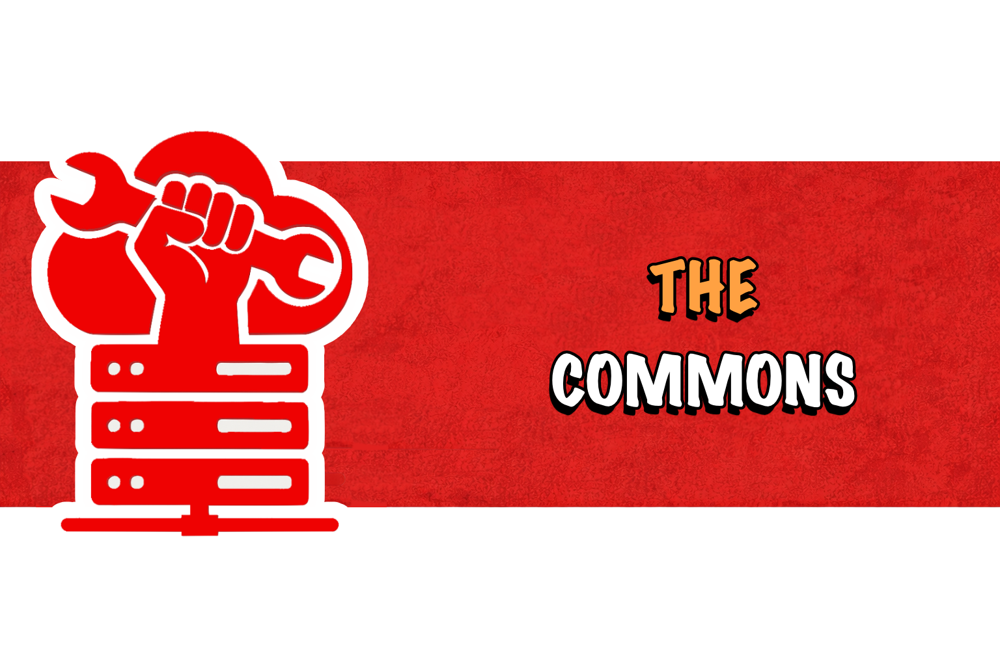

<p align="center">
  
</p>

# Federated Commons

A Terraform module library for self-hosting an identity-managed application suite on Scaleway. This is an **upstream blueprint** — you do not run it directly. You consume tagged versions of its modules from your own infrastructure repository.

Modules cover the two layers that are tedious to get right: provider-side primitives (network, compute, storage, secrets, DNS) and an opinionated Authentik configuration (flows, sources, groups, per-app providers). Application deployment is left to you.

---

## Repository layout

```
terraform/
├── infrastructure/modules/
│   ├── app_dns/                  # Data-driven DNS records (A/AAAA/CNAME/TXT/MX)
│   ├── common_security_rules/    # Reusable inbound/outbound rule sets
│   ├── compute/                  # Scaleway Instance + cloud-init
│   ├── network/                  # Private network + VPC wiring
│   ├── secrets/                  # Scaleway Secret Manager wrapper
│   ├── security_group/           # Security group + rules composition
│   └── storage/
│       ├── object_bucket/        # S3-compatible bucket + IAM
│       └── postgres/             # Managed PostgreSQL
│
└── authentik/
    ├── modules/
    │   ├── instance/             # Instance-wide config: brand, flows, sources, outpost
    │   ├── oidc-app/             # One OIDC provider + application
    │   ├── saml-app/             # One SAML provider + application
    │   ├── bookmark/             # External-link application tile
    │   └── traefik-forward-auth/ # Forward-auth provider for Traefik
    └── apps/                     # Pre-composed per-app bundles (Outline, Nextcloud, ...)
```

A reference consumer lives under [`consumer-template/`](./consumer-template/) — copy it, fill in your config, and `terraform apply`.

---

## Consuming a module

Every module is consumed by Git ref, pinned to a tag. **Never** consume `master`; tagged versions are the contract.

```hcl
module "private_network" {
  source = "git::https://github.com/sheyaln/sabokit.git//terraform/infrastructure/modules/network?ref=infra-modules-v0.4.0"

  name   = "prod-internal"
  region = "fr-par"
}
```

The `?ref=<tag>` is mandatory. See [Versioning](#versioning) below for what each tag promises.

### Bumping a version

Use a single sed pass across your consumer repo:

```bash
OLD=infra-modules-v0.4.0
NEW=infra-modules-v0.5.0
grep -rl "ref=$OLD" terraform/ | xargs sed -i '' "s|ref=$OLD|ref=$NEW|g"
terraform -chdir=terraform/infrastructure init -upgrade
terraform -chdir=terraform/infrastructure plan
```

A pinned-bump helper script is included in the consumer template.

---

## What you bring, what the modules bring

Modules are **infrastructure primitives and identity wiring** only.

| Modules provide                        | You provide                                  |
|----------------------------------------|----------------------------------------------|
| Network, compute, storage, DNS, secrets| Provider credentials, region, project IDs    |
| Authentik flows, sources, outpost      | Authentik server (run via Helm/Docker/etc.)  |
| Per-app OIDC/SAML providers            | The app itself (Helm chart, Compose, k8s)    |
| Group taxonomy hooks                   | Your group names and member assignments      |

Application runtimes (Docker, Kubernetes, Ansible) are intentionally not in scope. The modules give you the identity provider, the DNS records, and the storage your apps will plug into.

---

## Versioning

Tagged releases follow [semver](https://semver.org/):

- **Patch** (`v0.4.1`) — bug fixes, doc-only changes. Always safe.
- **Minor** (`v0.5.0`) — additive: new variables (with defaults), new outputs, new modules. Safe.
- **Major** (`v1.0.0`) — breaking: variable renames, removed inputs/outputs, resource address changes requiring `terraform state mv`. Upgrade notes ship with the release.

Find tags at [github.com/sheyaln/sabokit/tags](https://github.com/sheyaln/sabokit/tags). Release notes describe required state moves for major bumps.

---

## Module conventions

Every module follows the contract in [CONVENTIONS.md](./CONVENTIONS.md). Highlights:

- Required inputs have no default. Optional inputs default to a generic value or `null` (meaning "create one for me").
- Modules never assemble subdomains. You pass full hostnames as inputs.
- Every module exposes raw resource IDs and an `extra_*` pass-through where useful.
- No org-specific defaults. No hardcoded group names, no hardcoded URLs.

Per-module documentation lives next to each module's `main.tf`.

---

## Project status

`v0.x` — module APIs may still shift. Breaking changes will be tagged as `v1.0.0` once the contract stabilises. Consumer feedback that this should happen sooner is welcome via issues.

## License

[MIT](./LICENSE).
