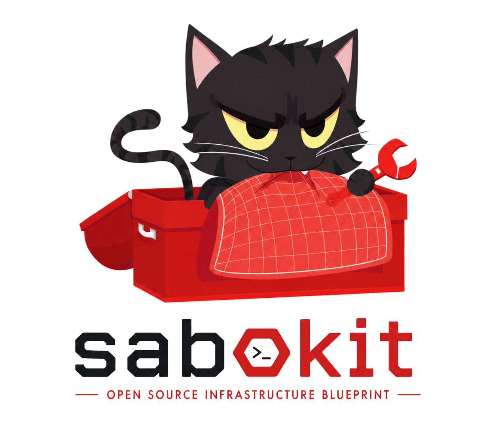

# Sabokit



A Terraform + Ansible blueprint for self-hosting an identity-managed application suite on Scaleway. You consume tagged versions of its modules from your own infrastructure repository — clone [`consumer-template/`](./consumer-template/), fill in per-env config, run three commands.

The blueprint covers the two layers that are tedious to get right: provider-side primitives (network, compute, storage, secrets, DNS) and an opinionated Authentik configuration (flows, sources, groups, per-app providers). One pre-baked Scaleway image per release cuts host-bootstrap time from ~10 minutes to under one.

---

## Quick start

Install the CLI once:

```bash
curl -fsSL https://raw.githubusercontent.com/sheyaln/sabokit-cli/master/install.sh | bash
```

Scaffold a project + deploy:

```bash
sabokit init my-stack --env prod --base-domain example.com
cd my-stack

# fill in the env config (committed YAML)
$EDITOR environments/prod/env.yml           # project_id, domains, infra_email, sizing
$EDITOR environments/prod/application.yml    # which apps, at which hostnames
for l in infra identity operations application; do
  cp environments/prod/$l/backend.hcl.example environments/prod/$l/backend.hcl
done

# Scaleway credentials + arm64 fallback (runner image is amd64-only)
export SCW_ACCESS_KEY=... SCW_SECRET_KEY=... SCW_DEFAULT_PROJECT_ID=...
export SABOKIT_PLATFORM=linux/amd64   # arm64 hosts only

sabokit up        # infra → identity → operations → application
sabokit deploy    # redeploy apps via the runner container
sabokit status    # terraform outputs + docker ps across hosts
```

`sabokit init` clones consumer-template at a pinned tag and writes `.sabokit/config.yml`. `sabokit up` chains the per-layer deploy scripts (`scripts/up.sh`) locally. `sabokit deploy` runs ansible against the env via the published runner image — no local terraform or ansible install required for redeploys.

Full CLI reference: [github.com/sheyaln/sabokit-cli](https://github.com/sheyaln/sabokit-cli).

### Faster cold-starts with a pre-baked image

Import the sabokit base image once per Scaleway project and provisioning skips ~7 minutes of apt installs:

```bash
./consumer-template/scripts/import-base-image.sh v3.3.2
# → prints IMAGE_ID; paste into environments/<env>/hosts.yml under compute_hosts.<host>.image
```

See [`packer/README.md`](./packer/README.md) for the maintainer-side build flow.

---

## Repository layout

```
platform/                               # The platform, re-tiered into four layers.
├── _shared/                            # Reusable wrappers every layer draws on.
│   ├── infrastructure/{app_dns, common_security_rules, compute, network,
│   │                    secrets, security_group, storage/{object_bucket,
│   │                    postgres, postgres_database}}
│   ├── authentik/{oidc-app, saml-app, bookmark, traefik-forward-auth}
│   └── contract/                       #   Rebuilds `base` from ${org}-${env} data sources.
├── infra/                              # Layer 1 — Scaleway substrate (birth-once).
│   ├── terraform/                      #   VPC, compute, postgres (incl. Authentik's DB),
│   │                                   #   TEM, gateway DNS, per-role SGs, secrets.
│   ├── ansible/roles/                  #   docker, traefik, ufw, monitoring-agent (Alloy), …
│   ├── authentik-bootstrap/            #   Authentik admin/DB/token secrets (root of trust).
│   ├── host-services/{diun, autoheal, wazuh-agent}
│   └── base-image/ + runner-image/     #   Packer base image + the docker runner image.
├── identity/                           # Layer 2 — Authentik config (configured via the API).
│   ├── terraform/                      #   Flows, brand, tier groups + nesting.
│   └── ansible/roles/authentik-server/ #   Installs the Authentik docker stack.
├── operations/                         # Layer 3 — observability + protonmail-bridge.
│   └── {loki, prometheus, grafana, wazuh, protonmail-bridge}/{terraform, ansible}
├── application/                        # Layer 4 — the user-facing app suite + the outpost.
│   └── {outline, nextcloud, …, backrest}/{terraform, ansible}
└── ansible/                            # Orchestration only — generated import-playbooks.
    ├── bootstrap.yml                   #   docker, traefik, …, authentik-server.
    ├── host-services.yml / operations.yml / application.yml
    └── site.yml                        #   bootstrap + host-services + operations + application.

consumer-template/                      # The starter you cp into your own repo.
├── environments/
│   ├── common.yml                      #   org_slug, org_name (cross-env).
│   └── _template/                      #   Copy to prod/, staging/, … (dir name = env name).
│       ├── {env,hosts,infra,identity,operations,application}.yml   # committed config.
│       └── {infra,identity,operations,application}/  # one TF root per layer, own state.
└── scripts/{lib,infra,identity,operations,application,up,down,bump-version}.sh

tests/local-validate/                # Per-bundle terraform-validate harness for CI.
tests/stack-composition-validate/    # Validates the four consumer roots end-to-end.
```

---

## Consuming a module

Every module is consumed by Git ref, pinned to a tag. **Never** consume `master`; tagged versions are the contract.

```hcl
module "private_network" {
  source = "git::https://github.com/sheyaln/sabokit.git//platform/_shared/infrastructure/network?ref=v2.1.0"

  name   = "prod-internal"
  region = "fr-par"
}
```

Most consumers won't call low-level modules directly — they copy `consumer-template/environments/_template`, which holds one Terraform root per layer (`infra/`, `identity/`, `operations/`, `application/`). Each root's `stack.tf` sources `//platform/<layer>/terraform?ref=<tag>` and the layers self-discover each other by name (no remote_state).

### Bumping a version

`consumer-template/scripts/bump-version.sh v2.1.0` rewrites every `?ref=` pin under `environments/*/*/stack.tf` AND moves the `sabokit` checkout to the same tag in one pass. Leaves the working tree dirty — you commit.

---

## What this repo provides, what you provide

| Blueprint provides                                          | You provide                                       |
|-------------------------------------------------------------|---------------------------------------------------|
| Scaleway network, compute, postgres, storage, DNS, secrets  | Scaleway project + IAM credentials                |
| Authentik instance (flows, brand, social sources, outpost)  | Operations contact email + your group taxonomy    |
| Per-app OIDC/SAML providers + S3 buckets + per-app DBs      | Your hostnames (`wiki.example.org`, etc.)         |
| Ansible roles to deploy each app via docker-compose         | Your inventory (host group memberships)           |
| `consumer-template/` with the 3-step deploy flow            | Your domains, registered + delegated to Scaleway  |
| Optional pre-baked Scaleway image (~3 min bootstrap)        | Optional: cross-project DNS credentials           |

Substrate assumption: Docker Compose on Scaleway VMs. K8s consumers would fork the `ansible/` side of each app bundle and replace it with manifests.

### Cross-project DNS

When your DNS zone lives in a Scaleway project separate from your infra (common for orgs that centralize domains), override the `scaleway.dns` aliased provider in your `providers.tf` with separate credentials. See `consumer-template/environments/_template/providers.tf` for the pattern.

---

## Versioning

Tagged releases follow [semver](https://semver.org/):

- **Patch** (`v1.0.1`) — bug fixes, doc-only changes. Always safe.
- **Minor** (`v1.1.0`) — additive: new variables (with defaults), new outputs, new app bundles. Safe.
- **Major** (`v2.0.0`) — breaking: variable renames, removed outputs, resource address changes requiring `terraform state mv`. Migration notes ship with the release.

Find tags at [github.com/sheyaln/sabokit/tags](https://github.com/sheyaln/sabokit/tags). Pre-1.0 tags (`infra-modules-v0.4.0`) exist for the legacy library shape and are not compatible with the v1.x platform layout.

---

## Module conventions

Every module follows the contract in [CONVENTIONS.md](./CONVENTIONS.md). The platform↔app contract lives in [ARCHITECTURE.md](./ARCHITECTURE.md). Highlights:

- Required inputs have no default. Optional inputs default to a generic value or `null` (meaning "create one for me").
- Modules never assemble subdomains. You pass full hostnames as inputs.
- Every app bundle is `enabled`-gated. `enabled = false` provisions zero resources.
- No org-specific defaults. No hardcoded group names. No hardcoded URLs.

Per-module documentation lives next to each module's `main.tf`.

---

## Project status

The end-to-end consumer flow (`sabokit init` → `sabokit up` → `sabokit deploy`) is dogfooded against a real staging Scaleway project every release cycle. The platform↔app contract is validated in CI by `tests/local-validate/`. Adding a new app: copy `platform/application/outline/` as the reference and follow the bundle contract in [CONVENTIONS.md](./CONVENTIONS.md).

## License

[MIT](./LICENSE).
